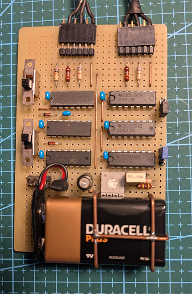
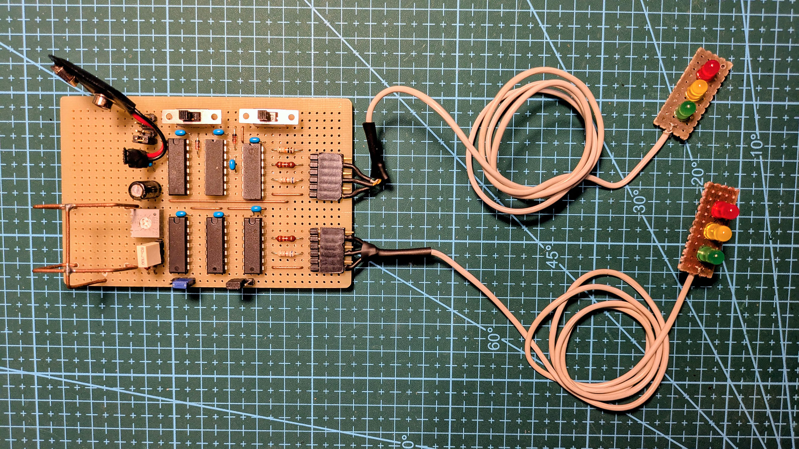
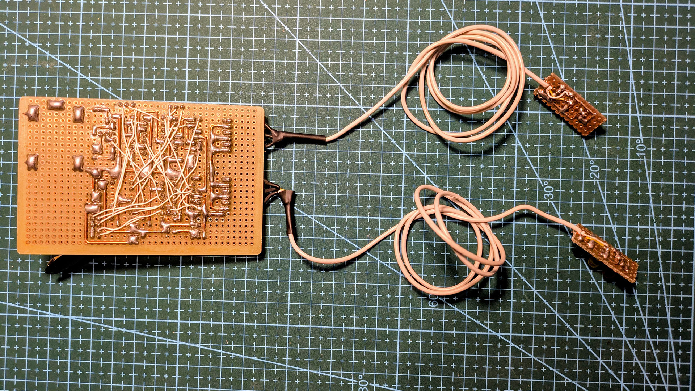
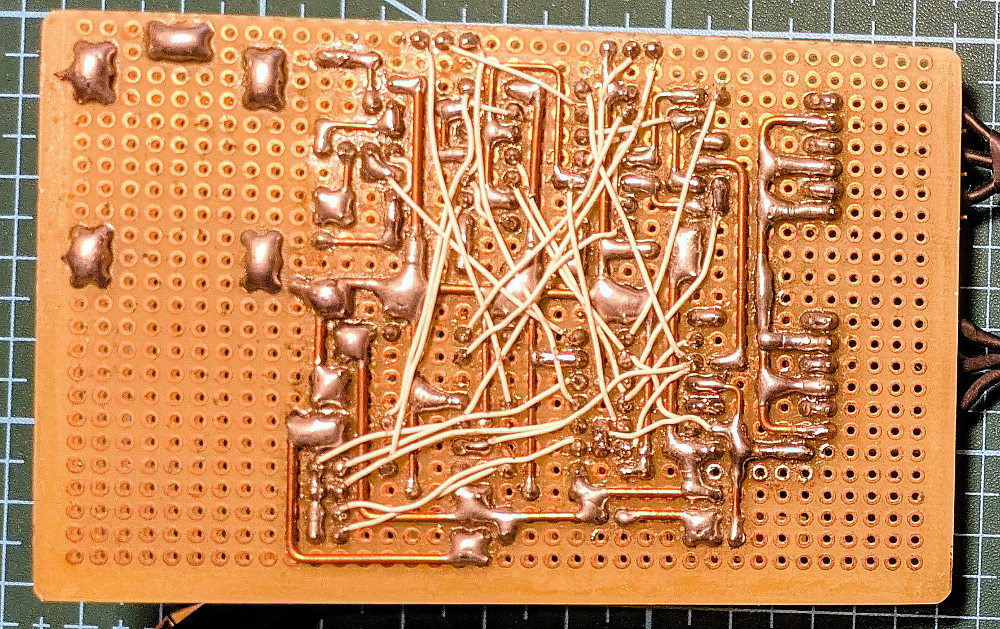

# Toy Semaphore
A simple discrete logic toy traffic lights controller (without microcontroller)

## Files
- simulation.v, semi-structural simulation in Verilog
- SemSim.pdf, Screenshot of the "iverilog" simulation shown with GtkWave
- SemLayout.pdf - High-definition schematic diagram with a proposed physical layout

</a>

</a>

</a>

</a>

</a>

</a>

